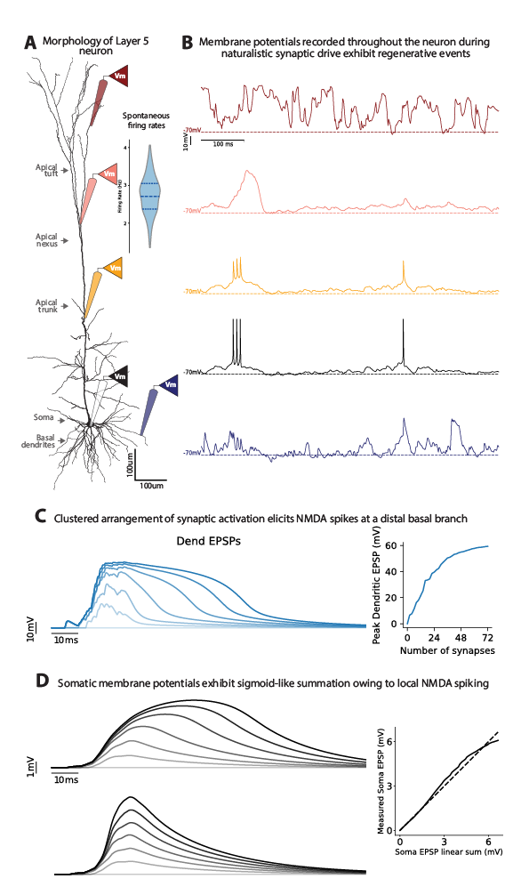
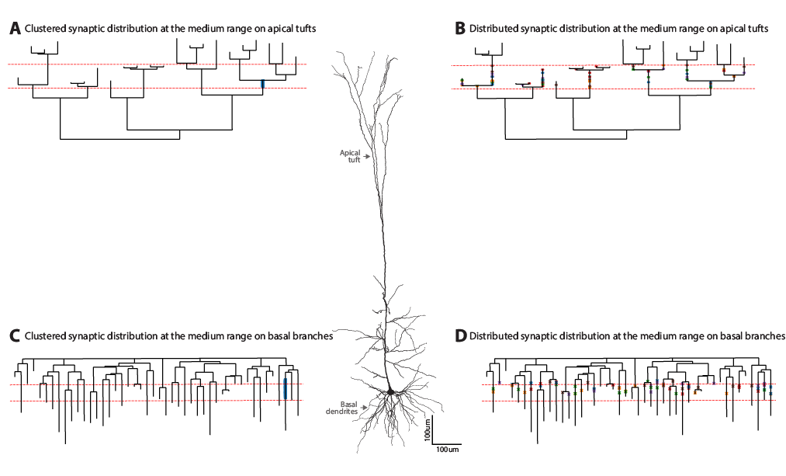
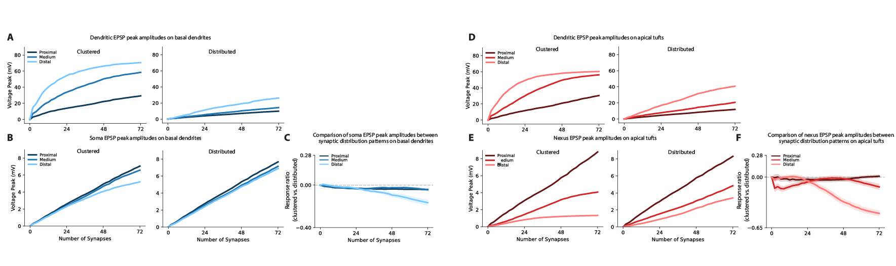
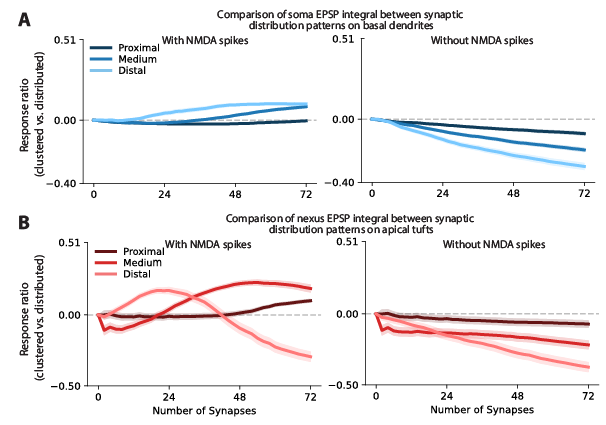

# Dendritic Synaptic Clustering in a Biophysical L5 Pyramidal Neuron

This repository studies how **clustered vs distributed synaptic inputs** shape dendritic nonlinear events and somatic responses in a detailed NEURON model of a layer 5b pyramidal neuron.

**Status:** Research preview (manuscript in preparation; not yet published).

## Scientific Question

How does synaptic input organization along the dendritic tree

`input organization -> local dendritic nonlinearity -> somatic output`

change integration efficacy under both in vitro-like and in vivo-like conditions?

## Key Findings

- Clustered and distributed synaptic inputs produce **comparable integrated somatic responses** under matched stimulation constraints.
- **NMDA-dependent dendritic nonlinearities** allow clustered synapses to achieve response efficacy similar to distributed controls.
- Clustered synapses are **less sensitive to temporal jitter** and can produce **longer-lasting somatic responses**.
- Naturalistic background synaptic drive reduces integration efficacy on basal dendrites, while increasing low-activation gain on distal apical tuft branches.

## Figure Roadmap (Placeholders)

### Figure 1. Model Validation and Naturalistic Neuronal Responses



Suggested caption focus: reconstructed morphology, realistic spontaneous activity, and baseline dendritic/somatic response properties.

### Figure 2. Clustered vs Distributed Synaptic Placement Across Dendritic Arborizations



Suggested caption focus: spatial matching protocol, basal/apical branch targeting, and distance-to-root bins.

### Figure 3. Comparable Integration Efficacy via NMDA-Mediated Compensation



Suggested caption focus: matched clustered/distributed comparisons for somatic response metrics, with emphasis on compensation across dendritic locations.

### Figure 5. NMDA Contribution to Somatic EPSP Integral (Area)



Suggested caption focus: NMDA-dependent enhancement of temporal summation and EPSP area under clustered activation.

## Project Status

| Component | Status |
|---|---|
| Simulation pipeline | Complete |
| Seed reproducibility framework | Validated |
| Single-cluster analysis | Complete |
| Multi-cluster analysis | In progress |
| Manuscript-quality figure set | In preparation |

## 5-Minute Quick Start

```bash
# 1) Compile NEURON mechanisms (once per platform/build)
cd mod
nrnivmodl
cd ..

# 2) Run one clustered condition (example)
python L5b_simulation.py --sec_type basal --spat_condition clus --num_epochs 1

# 3) Run matched distributed control (example)
python L5b_simulation.py --sec_type basal --spat_condition distr --num_epochs 1
```

For full options:

```bash
python L5b_simulation.py --help
```

## Reproducibility

The simulation separates random streams by biological role:

- `bg_syn_pos_seed`: background synapse locations and background excitatory weights
- `clus_syn_pos_seed`: clustered synapse assignment and clustered connectivity layout
- `bg_spike_gen_seed`: background pink-noise modulation and Poisson spike generation
- `clus_spike_gen_seed`: clustered presynaptic spike-time jitter

This seed ownership design makes clustered/distributed comparisons reproducible and auditable across runs.

## Repository Structure

```text
.
├── L5b_simulation.py        # Main CLI entry for simulation runs
├── utils/                   # Core model and stimulation pipeline
├── analysis/                # Post-hoc analysis modules and figure scripts
├── model/                   # Morphology, hoc templates, synapse parameter files
├── mod/                     # NEURON mechanism source files (.mod)
├── docs/                    # Architecture and implementation documentation
└── scripts/                 # Utility and reproducibility scripts
```

## Documentation

- Architecture and data flow: `docs/ARCHITECTURE.md`
- Technical conventions: `docs/CONVENTIONS.md`

## Scope and Current Limits

- This repository is in active manuscript preparation.
- Main conclusions are stable at the level reported in conference material.
- Additional multi-cluster sweeps and figure polishing are ongoing.
